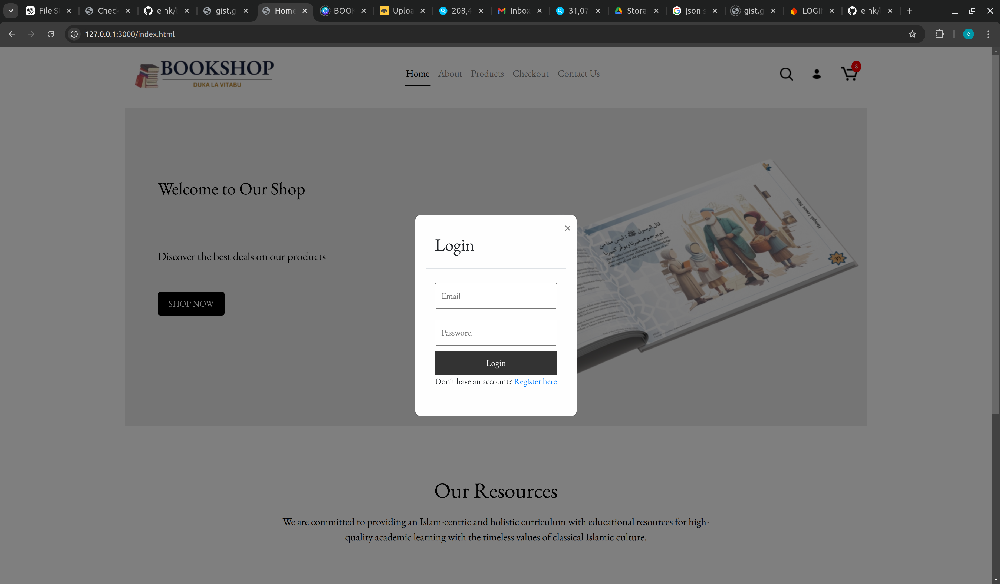
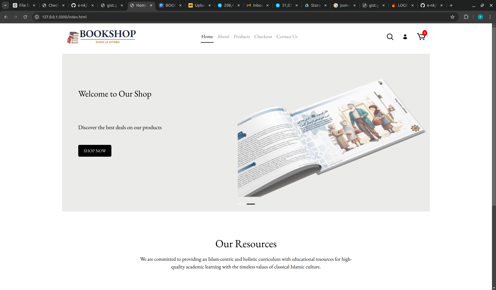
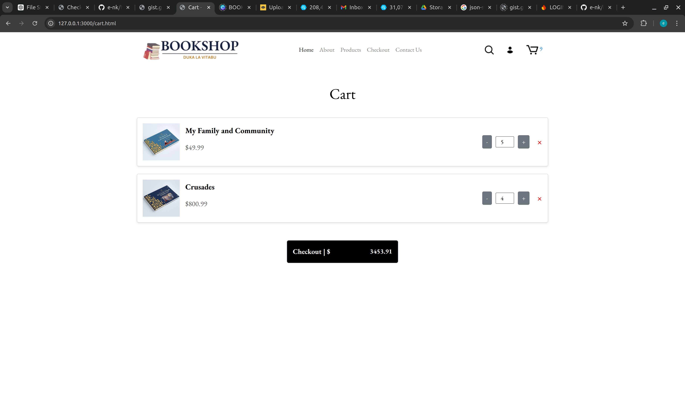
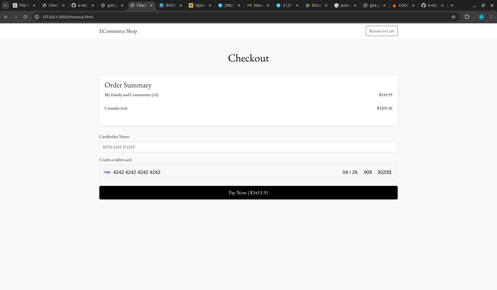

# ECommerce Shop

Welcome to the **ECommerce Book Shop**! This is a simple eCommerce web application built using HTML, CSS, JavaScript, and Firebase for user authentication and cart management. The site includes various features such as product listing, add-to-cart functionality, a shopping cart page, and a Stripe integration for checkout.

## Features

- **Home Page:** Contains a hero carousel with a "Shop Now" button to redirect to the product listings page.
- **Product Listing:** Displays a collection of products with options to add them to the cart. The quantity and total price are dynamically updated.
- **Shopping Cart:** A cart page where users can review the items, update quantities, and proceed to checkout.
- **Authentication (Login/Registration):** Firebase authentication allows users to create accounts and log in, ensuring that they can securely manage their shopping carts and proceed to checkout.
- **Checkout:** Uses Stripe for processing payments on the checkout page.
- **Responsive Design:** Mobile-friendly design with carousels for small and large screens.
- **User Authentication:** Login and registration are handled by Firebase Authentication, with password-based login and user creation.

## Screenshots

<div align="center">
  <table>
    <tr>
      <td></td>
      <td></td>
    </tr>
    <tr>
      <td></td>
      <td></td>
    </tr>
  </table>
</div>


## Technologies Used

- **HTML, CSS, Bootstrap**: For page layout and styling.
- **JavaScript (Vanilla JS)**: For dynamic page functionality (add to cart, quantity updates, modal management).
- **Firebase**: For user authentication (Login, Registration).
- **Local Storage**: For storing cart items persistently between page reloads.
- **Stripe**: For payment processing.

## Project Structure

```bash
├── css/
│   ├── style.css        # General styles for the site
│   ├── auth.css         # Specific styles for the authentication modal
├── images/              # Contains images for products, logo, icons, etc.
├── js/
│   ├── auth.js          # Handles authentication modal and Firebase auth
│   ├── cart.js          # Handles cart operations and storage
│   ├── products.js      # Fetches and displays products on the homepage
├── index.html           # Homepage with product listings and carousel
├── cart.html            # Cart page displaying items added to the cart
├── checkout.html        # Checkout page for processing payments
└── README.md            # Project documentation 
```

## Installation

1. Clone the repository:

```bash
git clone git@github.com:e-nk/bookshop.git

cd bookshop

```

2. Firebase Setup:

    - Go to Firebase Console.
    - Create a new project and enable Email/Password Authentication in Firebase Authentication.
    - Get your Firebase config from the Firebase Console and replace it in the auth.js file.

3. Stripe Setup:

    - Go to Stripe Dashboard.
    - Create a new Stripe account and get your publishable and secret keys.
    - Add the Stripe key in the `checkout.js` file.

4. Run the Application: Open `index.html` in your browser to view the homepage.

## Firebase Configuration

You need to add your Firebase project configuration in `auth.js`

```bash
const firebaseConfig = {
    apiKey: "YOUR_API_KEY",
    authDomain: "YOUR_AUTH_DOMAIN",
    projectId: "YOUR_PROJECT_ID",
    storageBucket: "YOUR_STORAGE_BUCKET",
    messagingSenderId: "YOUR_MESSAGING_SENDER_ID",
    appId: "YOUR_APP_ID"
};
```

## Checkout with Stripe
The checkout page includes an integration with Stripe to process payments:

- Users are required to enter their payment details (card information).
- Once the payment is processed, users are redirected to a success page.
- For testing, use Stripe's test card details:
    - **Card Number**: `4242 4242 4242 4242`
    - **Expiration Date**: Any future date
    - **CVC**: Any three digits

## Contributing

Contributions are welcome! If you find any issues or have suggestions for improvements, please open an issue or submit a pull request.

## License
This project is open-source and available under the MIT License.
```bash
Make sure to replace any placeholders (like `YOUR_API_KEY`) with the actual data from your Firebase project and Stripe account. You can adjust the README further based on your specific needs.
```